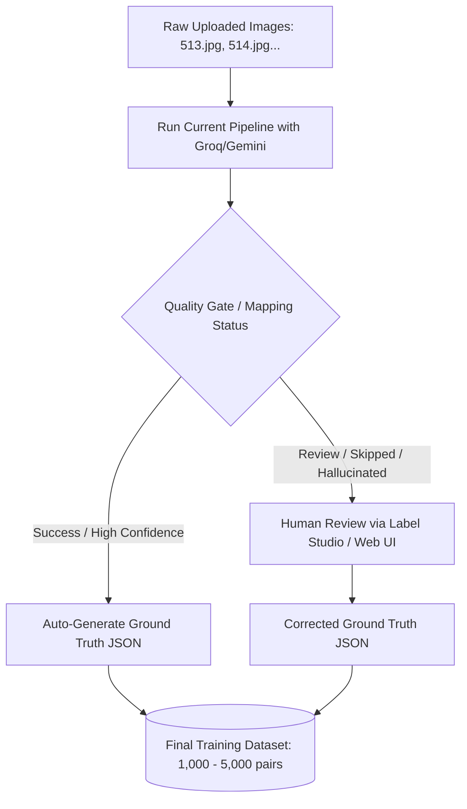
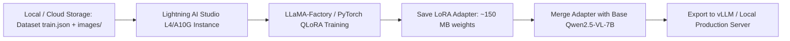

# Industrial Document OCR: Qwen2.5-VL-7B Fine-Tuning Architecture & Ground Truth Guide

## 1. Why You MUST Create a Ground Truth Dataset

Yes, **you absolutely must create a Ground Truth dataset**. 
Supervised Fine-Tuning (SFT / LoRA) works by teaching the model **Input-to-Output Mapping**:
- **Input:** The raw document image (`514.jpg`, `507.jpg`).
- **Ground Truth Output:** The exact desired structured JSON (`{"voucher_no": "052400015", "date": "27/06/2024", ...}`) that you want the model to generate when it sees that image.

### Why Ground Truth is Mandatory:
1. **Schema & Field Standardization:** The model needs to know your exact key names (`qty_mt` vs. `quantity`, `supplier_name` vs. `party_name`, `date` vs. `voucher_date`).
2. **Domain Vocabulary:** Teaching the model difficult Indian industrial terms (`DEOILED PADDY HUSK`, `GCV`, `WEIGHBRIDGE`, `HSN`, `Pty Bill`) so it stops OCR-hallucinating or outputting gibberish (`DEUCED PAODY`).
3. **Structured Formatting:** Teaching the model to output **pure, parseable JSON** directly from the image without Markdown backticks or conversational preamble (`"Here is the JSON:..."`).

---

## 2. How to Create the Ground Truth Dataset (Semi-Automated Pipeline)

Since you already have a working OCR + Cloud LLM (Gemini/Groq) pipeline in `outputs/results/*.json`, **do not annotate from scratch manually**. Use an **Auto-Bootstrapping Strategy**:



### Step-by-Step Ground Truth Creation:
1. **Auto-Accepts (70% of data):** Take all historical `outputs/results/*_ocr.json` files where `mapping.status == "success"`. Extract the image path and the `mapping.data` JSON. This instantly gives you hundreds of ground truth training pairs with zero human effort.
2. **Review / Failed Docs (30% of data):** For skipped or incorrect documents (like `507.jpg` or `514.jpg`), open them in an annotation tool (**Label Studio** or a simple local HTML/Streamlit review app), fix the JSON values, and save them.

---

## 3. Exact Dataset Format Required by Qwen2.5-VL-7B (ShareGPT / LLaVA Format)

To train `Qwen/Qwen2.5-VL-7B-Instruct`, your data must be structured as a JSON array (`train.json`) where each entry contains `messages` with an `<image>` tag in the user prompt.

### Sample Entry (`train.json`):
```json
[
  {
    "id": "doc_514",
    "images": [
      "dataset/images/514.jpg"
    ],
    "messages": [
      {
        "role": "user",
        "content": "<image>\nExtract all structured fields from this industrial voucher document as pure JSON with accurate numerical and date formats."
      },
      {
        "role": "assistant",
        "content": "{\"voucher_no\": \"052400015\", \"voucher_date\": \"27/06/2024\", \"supplier_name\": \"PASHA TRADERS\", \"state\": \"CG\", \"gstin\": \"22AAAAA0000A1Z5\", \"items\": [{\"name\": \"DEOILED PADDY HUSK\", \"hsn\": \"23021010\", \"qty_mt\": 9.14, \"rate\": 4659.30, \"amount\": 42586.0}]}"
      }
    ]
  },
  {
    "id": "doc_orientation_507",
    "images": [
      "dataset/images/507.jpg"
    ],
    "messages": [
      {
        "role": "user",
        "content": "<image>\nExamine the orientation of this document image. If rotated, what angle in degrees clockwise (0, 90, 180, 270) is needed to make the text upright?"
      },
      {
        "role": "assistant",
        "content": "270"
      }
    ]
  }
]
```

---

## 4. Cloud Fine-Tuning Architecture using Lightning AI Studio ($100 Credits)

Because you have **$100 in free credits** on **Lightning AI Studio** (or AWS), upgrading from 3B to **`Qwen/Qwen2.5-VL-7B-Instruct`** is the exact right move. The 7B model has dramatically superior visual reasoning and table-tracking capability.

### Hardware Comparison on Lightning AI Studio:
| GPU Instance | VRAM | Cost / Hour | $100 Credits Buy | Training Time (1,000 docs) | Recommendation |
| :--- | :--- | :--- | :--- | :--- | :--- |
| **L4 GPU** | 24 GB | ~$0.70 / hr | ~140 Hours | ~5 Hours | ✅ **Best Budget / Value for QLoRA 7B** |
| **A10G GPU** | 24 GB | ~$1.10 / hr | ~90 Hours | ~3.5 Hours | ✅ **Fastest 24GB QLoRA Training** |
| **A100 GPU** | 40 GB | ~$3.00 / hr | ~33 Hours | ~1.5 Hours | 🔥 **Required only for 16-bit Full LoRA** |

---

## 5. End-to-End Training Workflow on Lightning AI Studio



### Step 1: Launch Lightning AI Studio Environment
1. Log into **Lightning AI Studio** (`lightning.ai`).
2. Create a new Studio and select **GPU -> L4 (24GB VRAM)** or **A10G (24GB VRAM)**.
3. Open terminal in Studio and install **LLaMA-Factory** (the industry-standard tool for Qwen2.5-VL fine-tuning):
```bash
git clone --depth 1 https://github.com/hiyouga/LLaMA-Factory.git
cd LLaMA-Factory
pip install -e ".[torch,metrics]"
pip install qwen-vl-utils accelerate bitsandbytes peft
```

### Step 2: Register Your Dataset
Upload your `train.json` and `images/` folder to the Studio instance (or mount via S3/AWS Bedrock bucket).
Edit `data/dataset_info.json` inside `LLaMA-Factory`:
```json
{
  "industrial_ocr_docs": {
    "file_name": "/path/to/train.json",
    "formatting": "sharegpt",
    "columns": {
      "messages": "messages",
      "images": "images"
    },
    "tags": {
      "role_tag": "role",
      "content_tag": "content",
      "user_tag": "user",
      "assistant_tag": "assistant"
    }
  }
}
```

### Step 3: Run QLoRA Training (`qwen7b_lora.yaml`)
Create a training config file `qwen7b_lora.yaml`:
```yaml
### Model
model_name_or_path: Qwen/Qwen2.5-VL-7B-Instruct
quantization_bit: 4            # QLoRA (4-bit base model + 16-bit adapters fits cleanly in 24GB VRAM)
quantization_method: bitsandbytes

### Method
stage: sft
do_train: true
finetuning_type: lora
lora_rank: 32
lora_target: all               # Targets all attention and MLP projection layers for best OCR vision adaptation
lora_alpha: 64
lora_dropout: 0.05

### Dataset
dataset: industrial_ocr_docs
template: qwen2_vl
cutoff_len: 2048
max_samples: 10000
overwrite_cache: true
preprocessing_num_workers: 8

### Output
output_dir: saves/Qwen2.5-VL-7B/lora/industrial_ocr_v1
logging_steps: 10
save_steps: 100
plot_loss: true
overwrite_output_dir: true

### Training Hyperparameters
per_device_train_batch_size: 1
gradient_accumulation_steps: 8 # Effective Batch Size = 8
learning_rate: 1.0e-4
num_train_epochs: 3.0
lr_scheduler_type: cosine
warmup_ratio: 0.1
bf16: true                     # Supported natively on L4 / A10G / A100
gradient_checkpointing: true
optim: adamw_bnb_8bit
```

Launch the training job:
```bash
llamafactory-cli train qwen7b_lora.yaml
```
*Note: For 1,000 documents across 3 epochs, this training job will complete in approximately **3 to 4 hours** on an L4/A10G GPU, consuming only **~$3.00** of your $100 free credit budget!*

---

## 6. Export & Deployment (Local vs. Cloud)

Once training finishes, you have two options for serving:

### Option A: Direct Runtime LoRA Loading in `root/model.py` (Zero VRAM Overhead)
Instead of copying 15GB of base weights, just copy the **150 MB LoRA Adapter folder (`saves/.../industrial_ocr_v1`)** to your deployment server.
In `root/model.py`:
```python
from transformers import Qwen2_5_VLForConditionalGeneration, AutoProcessor
from peft import PeftModel
import torch

# 1. Load Base Model in 4-bit / 16-bit
base_model = Qwen2_5_VLForConditionalGeneration.from_pretrained(
    "Qwen/Qwen2.5-VL-7B-Instruct",
    torch_dtype=torch.float16,
    device_map="auto"
)

# 2. Attach Fine-Tuned Industrial LoRA Adapter
model = PeftModel.from_pretrained(base_model, "./saves/Qwen2.5-VL-7B/lora/industrial_ocr_v1")
model = model.merge_and_unload() # Merges weights in memory at speed of base model

processor = AutoProcessor.from_pretrained("Qwen/Qwen2.5-VL-7B-Instruct")
```

### Option B: High-Throughput Production Inference (`vLLM`)
If you process large batches, merge the weights permanently and run via `vLLM`:
```bash
# Merge LoRA into base weights and save
llamafactory-cli export qwen7b_merge.yaml

# Serve via vLLM (10x faster inference)
vllm serve ./merged_industrial_qwen7b --limit-mm-per-prompt image=1 --max-model-len 2048
```

---

## 7. Summary Checklist for Immediate Action

1. **Auto-Extract Ground Truth:** Write a Python script to scan `outputs/results/*.json` (`mapping.status == "success"`) and generate `train.json` automatically.
2. **Launch Studio:** Spin up a **24GB L4 GPU** on Lightning AI Studio using your $100 credits.
3. **Train 7B Model:** Run `llamafactory-cli train qwen7b_lora.yaml` for 3 epochs (~3.5 hours).
4. **Deploy:** Download the small `~150 MB` adapter directory back to your app and point `root/model.py` to it. You will immediately see near-zero orientation hallucinations and exact structured JSON outputs without needing Gemini/Groq APIs.
