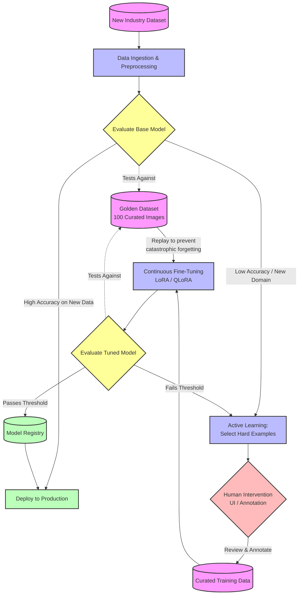

# Continuous LLM Evaluation and Training Architecture

This architecture outlines a fully automated, scalable pipeline for evaluating and fine-tuning an LLM (such as an OCR model) whenever data from a new industry is introduced. It incorporates a **Golden Dataset** to ensure baseline quality and a **Human-in-the-Loop (HITL)** process for efficient training.

## Architecture Diagram

## How It Works

### 1. The Golden Dataset (The Anchor)
Your golden dataset of ~100 highly curated images acts as your universal baseline. 
- **During Evaluation:** Every time the model encounters a new industry, it is evaluated against this dataset to ensure it hasn't lost its core capabilities.
- **During Training:** These 100 images are mixed in with the new industry data during fine-tuning. This is called **Experience Replay** and it prevents "catastrophic forgetting" (where the model learns the new industry but forgets the old ones).

### 2. Handling New Industry Data (Automated Ingestion)
When a new dataset arrives (e.g., medical documents instead of retail receipts), the pipeline automatically ingests it and runs a baseline evaluation using your current model. 
- If the model already performs well (above a certain threshold), no training is needed.
- If it struggles, the pipeline triggers the training phase.

### 3. Human Intervention (Active Learning)
You don't want humans to manually review thousands of new images. Instead, the pipeline uses **Active Learning**:
- The model runs inference on the new dataset and flags images where its "confidence score" is low.
- Only these tricky, low-confidence images are sent to a human review queue (e.g., using a tool like Label Studio or a custom UI).
- Humans correct or verify the model's output, creating a small, highly valuable training set for the new industry.

### 4. Continuous Fine-Tuning
Once the humans have annotated enough samples (e.g., a batch of 50-200 images), a training job (using Parameter-Efficient Fine-Tuning like LoRA) automatically kicks off. 
- The training data consists of: `Human Annotated New Data + Golden Dataset`.

### 5. Final Evaluation & Deployment
The newly trained model is evaluated one final time against the Golden Dataset and a holdout set of the new industry data. 
- If it passes the accuracy threshold, it is automatically pushed to the **Model Registry** and deployed as the new active model.
- If it fails, the confusing examples are routed back to the humans for further review.

## Technology Stack Recommendations
- **Orchestration:** Apache Airflow or Prefect (to connect all these steps).
- **Human Annotation:** Label Studio (has great APIs for integrating into automated pipelines).
- **Training/Evaluation Tracking:** MLflow or Weights & Biases (W&B) to track metrics against the Golden Dataset.
- **Fine-Tuning:** Hugging Face `peft` (LoRA) for fast, resource-efficient training.
